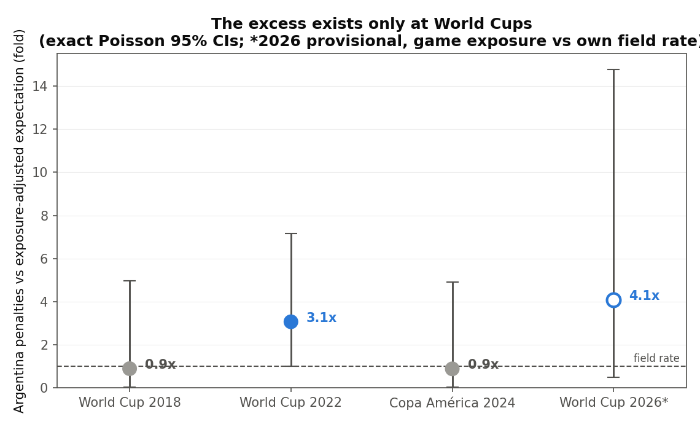

# Refereeing Asymmetry at the FIFA World Cup

An identification study of penalty awards to Argentina, 2018–2026 — built on raw
StatsBomb event data (160 matches), seven identification designs, exact inference,
and pre-registered predictions for the ongoing 2026 tournament.

**📄 The paper: [`latex/main.pdf`](latex/main.pdf)** — everything below is a map to it.



## The finding, in four sentences

Conditional on penalty-opportunity exposure (touches in the opponent's box), Argentina's
2022 penalty haul was **3.1× expectation** — the largest deviation of all 32 teams (exact
p = 0.020) — while their own 2018 and Copa América 2024 records are dead average
(0.9×), and the pattern recurs in 2026 at **4.1×** that tournament's own depressed
penalty rate (provisional). All four dubious penalty decisions in their 2022 matches
broke their way, and Argentina leads the field in dubious VAR decisions benefited from
(4 of the tournament's 12; selection-corrected p = 0.021–0.05, null-dependent). The
inference **forks on hypothesis provenance**: as an ex-post discovery, the frequency
evidence does not clear a family-wise bar (p ≈ 0.30); as the documented standing
accusation, the combined evidence reaches **p ≈ 0.016**, degrading no further than
~0.05 under every conservative variant examined. What no branch supports: intent,
orchestration, or generalized favoritism — the asymmetry is penalty-only, with no
defensive shielding and full price paid on cards.

## The seven designs

| | Design | Kills the explanation... | Key result |
|---|---|---|---|
| A | Opportunity-conditioned exact tests | "they attack more" | 3.1×, exact p = 0.020; family-wise p = 0.30 |
| B | Call-quality grading (2 nulls) | "the calls were correct" | 4/4 dubious pro-Argentina; p = 0.23 exposure-conditioned |
| C | Difference-in-differences | "they're just elite" | Argentina × WC2022 = 4.15×; own control 0.9× |
| D | Falsification (defensive symmetry) | — reported against interest | No shielding; conceded *above* expectation |
| M | Five-margin decision surface | "favored in everything" | Penalty-only; punished on cards |
| L | Leverage gradient | — | Favored exactly where decisions are worth most (rank 3/32) |
| E | Field-wide VAR quality (2 nulls) | "everyone gets dubious calls" | Argentina leads (4 of 12); selection-corrected p = 0.021–0.05 |

Full results: [`reports/BIAS_IDENTIFICATION.md`](reports/BIAS_IDENTIFICATION.md) ·
[`reports/MULTIMARGIN_FINDINGS.md`](reports/MULTIMARGIN_FINDINGS.md) ·
methods and limits: [`reports/METHODOLOGY.md`](reports/METHODOLOGY.md)

## Pre-registered predictions (2026-07-07, tournament ongoing)

The paper registers falsifiable predictions **before** the tournament ends — the commit
timestamp is the proof of ex-ante (paper §7): **P1** the provisional 2026 counts survive
event-data verification; **P2** Argentina's remaining matches stay at/above the field
rate (direction only); **P3** end-of-tournament VAR audits will show Argentina leading
the field in dubious-favorable decisions — that dataset does not exist yet; **P4** the
falsifiers — what would count *against* the thesis — are registered alongside.

## Reproduce

```bash
python -m venv .venv && source .venv/bin/activate   # .venv\Scripts\activate on Windows
pip install -r requirements.txt

python src/build_box_exposure.py     # rebuild the 160-match dataset from StatsBomb (~7 min)
python src/bias_identification.py    # Designs A–D, exact simulations, combined inference
python src/multimargin_leverage.py   # Designs M, L, E under both nulls
```

Fixed seeds throughout; the builder sanity-checks itself against known totals
(29/23 penalties, Argentina 5–2–7, 16 bookings). On Windows set `PYTHONUTF8=1`.

## Repository structure

```
latex/          the paper (main.tex → main.pdf, latexmk -pdf)
src/            analysis pipeline (3 core scripts above + 6 legacy analyses)
data/           all inputs + built datasets; provenance per item in data/SOURCES.md
reports/        METHODOLOGY.md + the two generated findings reports
reports/legacy/ auto-generated outputs of the six legacy analyses (superseded by the paper)
figures/        all generated figures
```

The six legacy scripts (`analyze`, `baseline_comparison`, `exposure_and_scorecard`,
`fullfield_regression`, `structural_break`, `conspiracy_window`) are the foundational
analyses this study builds on — the paper reports their results as context (§4.1) and
they remain runnable; their reports regenerate into `reports/legacy/`.

## Attribution, license & citation

This repository is a fork of
[kaimorales/argentina-worldcup-referee-analysis](https://github.com/kaimorales/argentina-worldcup-referee-analysis):
the six legacy analyses and their datasets are by **Kai Morales**; the identification
study, the event-data pipeline, and the paper are by **Bastián Rojas**. New
contributions are **MIT-licensed** (paper also CC BY 4.0); the original work carries no
license and its copyright remains with its author — exact scoping in
[`LICENSE`](LICENSE) and [`NOTICE`](NOTICE). Match event data:
[StatsBomb Open Data](https://github.com/statsbomb/open-data) (attribution required,
non-commercial). Cite via [`CITATION.cff`](CITATION.cff) (GitHub's "Cite this
repository" button).

*2026 data is provisional — collected from live reporting mid-tournament; every 2026
quantity is flagged and re-verified at tournament end (prediction P1).*
